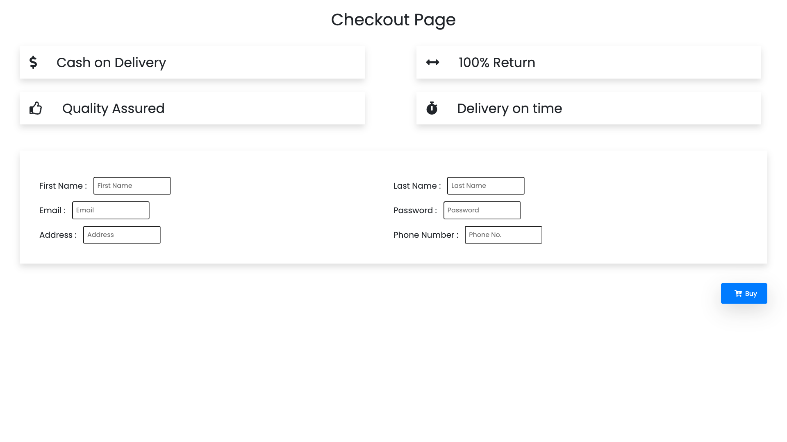

# **Shopping-Cart Project** 

## Level 1
---
### Exercise 1
---
First of all, as it is an e-commerce, we will make it possible for the user to add products to the cart.

The function you must complete is called buy() , which receives the id of the product to be added. You have to search for the product using this received id in the products array to finally add it to the cartList array.

The buttons that must execute the buy() function are the blue ones found on each product:

To do this exercise and the following ones, you must not change the name of the functions or their input parameters, nor translate any of the data that is in English.

Help: To find the product in the products array by id, you can use a for loop.

Help: Take the exercises slowly, it is not easy to learn to program.

### Exercise 2
---
Now we will implement a function that allows the user to delete the array generated in the previous exercise: empty the cart .

In this case, you'll need to fill in the cleanCart() function, which should reset the cartList variable.

### Exercise 3
---
Great, e-commerce is looking good! It is time to calculate the total amount of the cart.

A "for" loop must be implemented to add the amount of all the products picked.

### Exercise 4
---
You're doing great, you've almost completed level 1!

As you may have noticed, we have many repeated items in the shopping cart. It would be more convenient if they did not appear repeated, but if each product in the cart had a quantity field.

To do this, you'll need to complete the generateCart( ) function, which receives the cartList array, generating the cart array.

An example of each element of the cart array is:

{
  name: 'cooking oil',
  price: 10.5,
  type: 'grocery',
  quantity: 3,
  subtotal: 31.5,
},

Help: Simply make a loop over the cartList array, and in each iteration of the loop, that is, for each element of cartList, we must validate if this product exists in the cart array:

If it doesn't exist, we add it to the cart array (be careful, don't forget to add the quantity property with value 1 to the product before pushing).
If, on the other hand, this product already exists in the cart, we must increase the quantity field.

### Exercise 5
---
To be a good e-commerce, we need to implement promotions, a very important section in any store.

For this, the client has transmitted two types of promotions that he wants for his e-commerce:

1. If the user buys 3 or more bottles of oil, the price of the product drops to 10 euros.
2. When buying 10 or more mixes to make cake, its price is reduced to 2/3.

In this exercise you must complete the applyPromotionsCart() function, which receives the cart array, modifying the subtotalWithDiscount field in case a promotion is applied:

{
  name: 'cooking oil',
  price: 10.5,
  type: 'grocery',
  quantity: 3,
  subtotal: 31.5,
  subtotalWithDiscount: 30
},

Help: as each product in the cart has a quantity, you can now check if it has a discount:

In case a product has a discount, the total price with discount must be saved in the field: subtotalWithDiscount.
In case the discount should not be applied, you do not need to save anything.

### Exercise 6
---
Until now, we have only implemented the logic of the main screen of the store. We will now implement the checkout form validation found in the checkout.js file.

To access this screen, you must click on the cart icon at the top right of the screen, and a modal will appear with the button that will take you to this screen.

You can see that there is a form with the fields name, surname, email, password, address and telephone:

